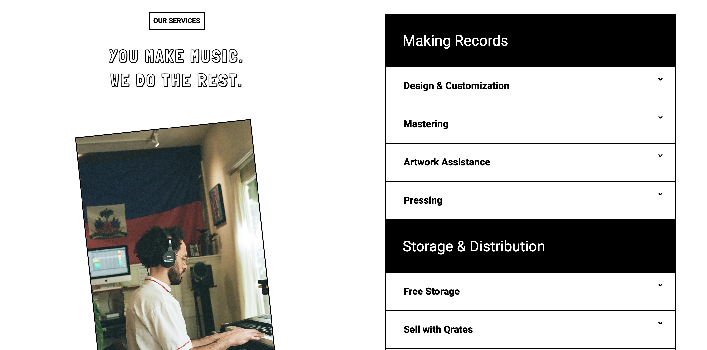

# qrates wordpress theme


This is a project that I worked to practice my CSS/HTML/JS and WP theme development skills. The design is from [Frontend Practice Project](https://www.frontendpractice.com/projects/qrates).

[Demo URL](https://qrates-demo.aglipanci.com/)

I have built the project using Advanced Custom Field PRO (ACF), specifically [Flexible Content](https://www.advancedcustomfields.com/resources/flexible-content/), in order to create a block-based editor, for easy-management and the ability to reuse the components as much as possible.

Libraries, Plugins and Frameworks used:

- [SwiperJs](https://swiperjs.com/) 
- [Tailwind CSS](https://tailwindcss.com/)
- [Advanced Custom Fields PRO](https://www.advancedcustomfields.com/pro/) 
- [Font Awesome](https://fontawesome.com/)  

### Installation & Build
To install dependencies run ```npm install```.

To watch changes ```npx tailwindcss -i ./src/input.css -o ./dist/output.css --watch```

To build for production ```npx tailwindcss -i ./src/input.css -o ./dist/output.css --minify```

### Components
**Hero Component**


**Caption Component**


**Column-Table Component**


**Services Component**


**Slider Component**


**Vinyl Component**


© All the images and information used in this website are property of Qrates.com. 
